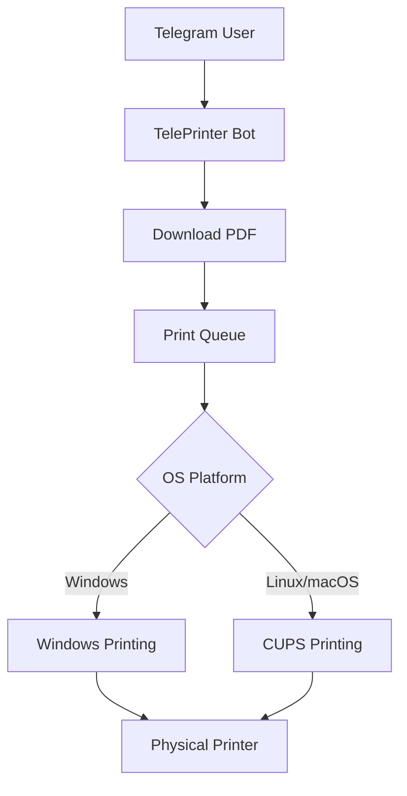

# TelePrinter - Telegram Bot for Automated File Printing

<p align="center">
   
   
   
</p>

## Overview

TelePrinter is a Telegram bot service that allows users to print PDF documents directly from Telegram chats. The system provides a seamless interface for submitting print jobs while enforcing usage policies to prevent abuse.

## Key Features

- 📄 PDF document printing via Telegram
- ⚙️ Cross-platform support (Windows, Linux, macOS)
- 🔒 Simple access control mechanism
- 📊 Basic usage logging
- ⚠️ Automatic print queue management

## Requirements

- Python 3.10+
- Telegram Bot API token
- Network-connected printer
- Required Python packages:
  ```bash
  pip install aiogram==2.x
  ```

## Configuration

1. Open a `settings.py` file with your Telegram bot token:
   ```python
   token="your_telegram_bot_token_here"
   ```

2. For Linux/macOS users, specify your printer name in the code:
   ```python
   printer_name = "your_printer_name_here"  # Replace with actual printer name
   ```

3. Set up the printer according to your OS:
   - **Windows**: Default printer will be used automatically
   - **Linux/macOS**: Ensure CUPS is configured and printer is accessible via `lpr`

## Installation & Setup

```bash
# Clone repository
git clone https://github.com/CYBER-NVORON/TelePrinter.git
cd TelePrinter

# Install dependencies
pip install -r requirements.txt

# Start the bot
python main.py
```

## Usage Instructions

1. Start a chat with your bot in Telegram
2. Send `/start` to see usage rules
3. Send any PDF document as a file attachment
4. The bot will:
   - Download the file
   - Add it to the print queue
   - Send status notifications
   - Print the document

## Rules of Use

1. Only print when physically near the printer
2. Do not abuse the printing infrastructure
3. No hacking attempts or attacks
4. Do not touch the printer hardware
5. Only PDF files are accepted

## System Architecture



## License

Project CYBER-NVORON.TelePrinter is distributed under the MIT License.

## Contribution

Contributions are welcome! Please open an issue or submit a pull request for any improvements.

## Security Notice

Violation of usage rules will result in service restriction. The bot operator maintains the right to block any user abusing the system.
